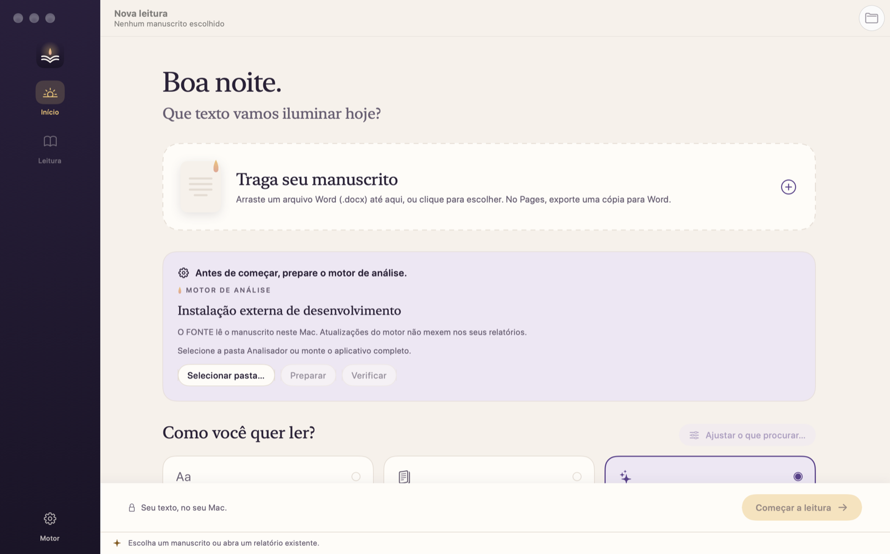

# Lume

**Revisão editorial para manuscritos em português, no Mac.** Uma luz acesa ao lado de quem escreve.

O Lume lê manuscritos do Word (.docx) e do Pages (.pages) e aponta:
- ortografia e gramática: LanguageTool embutido e regras próprias de crase, homófonos, concordância, regência, vírgula, correlação de tempos, frase cortada e locuções;
- tempo verbal da narração (passado ou presente);
- palavra repetida em sequência, frase duplicada, diálogos e variações de nomes.

Contradições narrativas são verificadas pela **Coerência com IA** (Claude), opcional. A **Auditoria final com IA** (Claude), também opcional, relê o livro depois das regras como controle de qualidade: só achados sólidos chegam ao editor. Sugestões e decisões ficam nos relatórios; o texto continua sendo do autor. A análise nunca altera o arquivo. Em documentos do Pages, o autor pode gravar a correção de um alerta no próprio arquivo (**Corrigir no manuscrito**): o Lume guarda antes uma cópia em `~/Library/Application Support/FONTE/Copias/`, usa o Pages para trocar só o trecho destacado e confere o resultado. O documento precisa estar **fechado** no Pages: o Lume recusa corrigir um arquivo que o autor tem aberto. Em **Editar parágrafo**, o autor reescreve o parágrafo do alerta e o Lume grava só a parte alterada.



Versão atual: **Lume 1.8 · FONTE 1.5.0 · Coerencia 1.2.0** — novidades no [CHANGELOG](CHANGELOG.md).

## Estrutura

| Pasta | Conteúdo |
| --- | --- |
| [`app/`](app/) | Aplicativo macOS em SwiftUI (`Lume/`) e projeto Xcode (`Lume.xcodeproj/`) |
| [`fonte/`](fonte/) | Motor **FONTE** (Python, pacote `fonte-revisor`): análise linguística e editorial, testes e corpus de detecção |
| [`coerencia/`](coerencia/) | Motor **Coerencia** (Python): contradições narrativas com a API do Claude, embutido no FONTE |
| [`packaging/`](packaging/) | Entrada do motor congelado e gerenciamento de pacotes `.lumemotor` |
| [`scripts/`](scripts/) | Montagem do motor e do app, preparação do LanguageTool e avaliações |
| [`tests/`](tests/) | Contratos Python/Swift e empacotamento |
| [`examples/`](examples/) | Manuscritos sintéticos, configurações e relatórios de referência |
| [`docs/`](docs/) | [Arquitetura](docs/arquitetura.md), [validação](docs/validacao.md), [visão](docs/visao.md), [identidade visual](docs/identidade/), produto e testes |
| `.agent/` | ExecPlans (`PLANS.md`) e planos de cada tarefa |
| `build/` | Entregas, logs e intermediários locais (fora do Git) |

Instruções para agentes de código estão em [AGENTS.md](AGENTS.md) e nos `AGENTS.md` de cada pasta.

## Usar a entrega

Extraia `Lume.app.zip` e copie `Lume.app` para Aplicativos. Feche a versão anterior antes de abrir a nova. Python, modelo de linguagem, LanguageTool e Java já vêm dentro do app.

Requer Mac com Apple Silicon e **macOS 27 ou posterior**. O motor embutido usa o Python e as bibliotecas (OpenSSL, xz) do Homebrew desta máquina de montagem, compiladas para o macOS 27; a montagem declara como mínimo o maior requisito entre os binários do motor e recusa um app que anuncie menos. Só o macOS 27.0.1 foi verificado.

A assinatura é local (ad hoc), sem Developer ID nem notarização: o macOS bloqueia a primeira abertura de um app baixado, e é preciso liberá-lo em Ajustes do Sistema → Privacidade e Segurança. Uma distribuição pública convencional exige assinatura Developer ID (conta Apple Developer) e notarização. Se **Motor** mostrar uma versão anterior, use **Restaurar embutido**. Versões, créditos e licenças ficam em **Lume → Sobre o Lume**. Relatórios, decisões e preferências ficam em `~/Library/Application Support/FONTE/`.

## Coerência com IA (Claude)

Opção da etapa Coerência global, desligada por padrão.

- **Chave:** em *Coerência com IA → Configurar chave…*. Fica nas Chaves do macOS (serviço `coerencia-anthropic`); o app a entrega ao motor por variável de ambiente.
- **Confirmação:** antes de enviar, o Lume mostra quais capítulos vão à Anthropic e o custo estimado; nada é enviado sem confirmar. Teto padrão: US$ 1,00 por análise.
- **Economia:** capítulos sem alteração não são reenviados (projeto por manuscrito em `~/Library/Application Support/FONTE/Coerencia/`); julgamentos repetidos saem do cache.
- **Modelo:** Sonnet 5.5 por padrão; Opus 5.5 como opção (custa o dobro).
- **Privacidade:** pela política atual da API, o texto enviado fica nos servidores da Anthropic por até 30 dias e não é usado para treino por padrão.

O Coerencia também roda sozinho no terminal: veja [coerencia/README.md](coerencia/README.md).

## Auditoria final com IA (Claude)

Última etapa da leitura, desligada por padrão porque custa dinheiro. Fica no painel **Auditoria final** da tela inicial e vale para os três modos.

- **O que faz:** o Claude relê cada capítulo com os alertas já encontrados e aponta só problemas novos (concordância, regência, crase, palavra faltando, continuidade dentro da cena e outras categorias fechadas). Os achados são suspeitas para avaliar: nunca erro confirmado, nunca confiança alta.
- **Conferência:** todo trecho citado pelo modelo é procurado no parágrafo. O que não existir, repetir um alerta, cair fora do escopo (uma regra desligada, por exemplo) ou repetir outro achado é descartado e contado no relatório.
- **Confirmação:** a mesma chave da Coerência. Antes de enviar, uma única confirmação mostra os trechos e o custo estimado de cada recurso ligado. Teto padrão: US$ 1,00 por análise.
- **Economia:** trechos sem alteração não são reenviados (projeto por manuscrito em `~/Library/Application Support/FONTE/Auditoria/`). Ao atingir o teto, o que já foi auditado fica guardado, e a próxima análise continua dali.
- **Modelo:** Opus 5.5 por padrão; Sonnet 5.5 como opção (custa a metade).
- **Falhas:** um erro da API interrompe só a auditoria; o relatório das outras etapas é mantido.
- **Medição:** num corpus sintético pequeno, a auditoria encontrou 6 dos 8 erros que as regras perderam no conjunto de validação, sem alarmes falsos ([validação](docs/validacao.md)). Não substitui uma avaliação em livros reais.

## Montar o aplicativo

Na raiz do repositório, em Mac Apple Silicon, com Xcode e Python 3.10–3.13 nativo arm64:

```sh
bash scripts/montar-lume.command
```

O comando:
1. prepara `fonte/.venv` e instala as dependências;
2. executa as regressões;
3. prepara o corretor gramatical embutido;
4. congela o motor;
5. compila a interface e monta a entrega em `build/<data>-<id>/Pacote/`, com app, ZIP e `release.json` (versões, diagnóstico e SHA-256).

Uma falha interrompe a montagem; não use como entrega uma pasta sem `release.json`.

O corretor (LanguageTool 6.6, com Java mínimo gerado por jlink) é preparado uma vez em `fonte/.languagetool` por `scripts/preparar_languagetool.py`. Isso exige JDK 17 ou posterior (por exemplo, `brew install openjdk`) e internet, e acrescenta cerca de 210 MB ao motor. Tudo roda no Mac. `scripts/build_engine.py --sem-languagetool` monta um motor sem ele.

Para compilar só a interface e reaproveitar um motor já produzido nesta versão:

```sh
xcodebuild -project app/Lume.xcodeproj -scheme Lume -configuration Release -derivedDataPath build/nova-montagem/DerivedData ARCHS=arm64 build
fonte/.venv/bin/python scripts/package_app.py --app build/nova-montagem/DerivedData/Build/Products/Release/Lume.app --engine /caminho/fonte-1.5.0.lumemotor --output build/nova-montagem/Pacote
```

O empacotador:
- exige uma pasta de saída nova;
- recusa motor de versão diferente dos fontes;
- valida inventário e funcionamento do motor;
- assina o app e repete as verificações no motor embutido.

Uma execução direta no Xcode usa o modo de desenvolvimento, com motor externo; para testar o motor embutido, use o app empacotado.

### Atualizações independentes do motor

```sh
bash scripts/montar-lume.command --motor
```

Produz `.lumemotor` e `.lumemotor.zip`, sem compilar a interface. No app:
- **Motor → Instalar atualização…** valida e testa o pacote antes de ativá-lo;
- **Voltar à versão anterior** reverte a seleção;
- **Restaurar embutido** volta ao motor do app.

Mantenha o pacote inteiro. Motores são código executável: importe somente pacotes de origem conhecida.

## Testes

Na raiz do repositório, com o ambiente preparado:

```sh
PYTHONPATH=fonte fonte/.venv/bin/python -m unittest discover -s fonte/tests
fonte/.venv/bin/python -m unittest discover -s tests -p 'test_*.py'
PYTHONPATH=fonte fonte/.venv/bin/python tests/check_python_contract.py
(cd coerencia && ../fonte/.venv/bin/python -m unittest discover -s tests)
```

A montagem completa executa também os testes Swift: contrato, correção no manuscrito, extração de falsos positivos, decisões por livro, ferramentas da mesa, encerramento da revisão, deduplicação e análise parcial.

A avaliação cega mede a detecção em textos que o motor não conhece. Ela gera um DOCX por texto do corpus anotado em `fonte/tests/corpus/deteccao/` e conta erros encontrados e alarmes falsos por categoria. Ela é guarda contra regressões, não a meta: a métrica principal é a precisão das pendências nas decisões reais ([validação](docs/validacao.md#protocolo-de-métricas)).

```sh
fonte/.venv/bin/python scripts/avaliar_deteccao.py --conjunto validacao --languagetool --saida build/avaliacao-nova
```

O conjunto `desenvolvimento` orienta correções; `validacao` fica reservado para medir. Os dois são sintéticos e foram escritos junto com as regras, por isso não substituem textos anotados por outra pessoa.

Com `--auditoria`, a Auditoria final com IA roda em cada texto e é medida à parte: erros que só ela encontrou, achados repetidos, sobre trechos aceitáveis e alarmes falsos. Isso chama a API da Anthropic e custa dinheiro; `--auditoria-teto-texto` e `--auditoria-teto-total` limitam o gasto, e a rodada para antes de um texto que poderia ultrapassar o teto total.

## Limites

O Lume interrompe o editor só quando há boa razão: poucos alertas, alta confiança e um ponto de encerramento claro. Ele não promete que nenhum erro restante existe, e encontrar um erro depois dele não pede, por si, uma regra nova ([visão](docs/visao.md#precisão-antes-de-cobertura-irrestrita)). A revisão é heurística e parcial. Confiança não é probabilidade calibrada, e a ausência de alertas não garante ausência de erros. A Auditoria final com IA é opcional e foi medida só num corpus sintético pequeno. Os manuscritos usados no desenvolvimento não constituem uma avaliação independente de precisão.

## Licença

O código do Lume (app, FONTE e Coerencia) é livre sob a [licença MIT](LICENSE): qualquer pessoa pode usar, copiar, modificar e distribuir, inclusive comercialmente, mantendo o aviso de copyright.

Os componentes de terceiros que acompanham o app mantêm suas próprias licenças. Entre eles estão o LanguageTool (LGPL-2.1), o OpenJDK (GPL-2.0 com Classpath Exception), o modelo de português do spaCy (CC BY-SA 4.0) e o PortiLexicon-UD (MIT). A lista completa, com os textos, fica na janela **Sobre o Lume** e em `fonte/fonte/data/` ([atribuições](fonte/fonte/data/ATRIBUICAO.md)).
